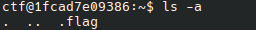

# SuSHi

Link to the challenge : https://hackropole.fr/en/challenges/misc/fcsc2020-misc-sushi/
## Description
You are provided an access to a machine through ssh. (login: `ctf`, password: `ctf`)
Your goal is to find the flag on the machine. 

## Solution 

Once connected to the host a first reflex is to check where we are and what is presented to us with `ls`. 

It seems like no visible file are present. 
We can use a deeper search with `ls -a` that will display hidden files

We find a hidden file `flag.txt`. We display it content with `cat .flag.txt` and it provides us the flag.
